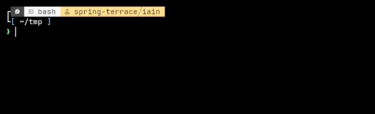

#  🐘 BAK

> Elephants never forget, but you might.

[`bak`](bak.sh) is a simple Bash script to create a timestamped copy of a file or directory. It will also prompt you to move the backup to a specified location directory. 



The script is designed for creating quick one-off copies and is not suitable for large-scale or automated backups.

Backups will have a timestamp followed by a `.bak` extension. For example, `file.txt` will be copied to `file.txt_2021-01-01_(12:00).bak`.

### Usage 
```sh
bak.sh <file or dir>
```
Replace `<file or dir>` with the path to the file or directory you wish to backup.

### Requirements

- Basic command line utilities (`cp`, `mv`, `mkdir`).

### Installation

Install the script to a directory in your PATH. For example, to install to `/usr/local/bin`:
```sh
mkdir -p ~/.local/bin
curl https://github.com/KennedyIDK/bash-scripts/backup-scripts/bak/bak.sh -o ~/.local/bin/bak.sh
```

Make the script executable:
```sh
chmod +x ~/.local/bin/bak.sh
```

Remove the `.sh` extension (optional):
```sh
mv ~/.local/bin/bak.sh ~/.local/bin/bak
```

### Configuration

You can customise the timestamp format and location directory by editing the variables at the top of the script. 

The default timestamp format is `%Y-%m-%d_(%H:%M)` - `:%S` will be included if required to resolve a clash (i.e you back up the same source twice in the same minute).

The default location directory for moving backups is `$HOME/backups`. The location directory will be created if it does not exist and you elect to move a backup. 

### License
This project is licensed under the MIT License - see the [LICENSE](LICENSE.md) file for details.
