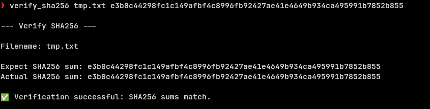

# Verify SHA-256 Hash

`verify_sha256.sh` is a script for verifying the SHA-256 hash of a file.

### Usage

```bash
verify_sha256.sh <file> <hash>
```


* I have removed the .sh extension for ease of use.

### Installation

Install the script to a directory in your PATH. For example, to install to `/usr/local/bin`:
```sh
mkdir -p ~/.local/bin
curl https://raw.githubusercontent.com/KennedyIDK/bash-scripts/main/general-scripts/verify_sha256/verify_sha256.sh -o ~/.local/bin/verify_sha256.sh
```

Make the script executable:
```sh
chmod +x ~/.local/bin/verify_sha256.sh
```

Remove the .sh extension (optional):
```sh
mv ~/.local/bin/verify_sha256.sh ~/.local/bin/verify_sha256
```

---

Also available as a custom action in [Thunar]().
